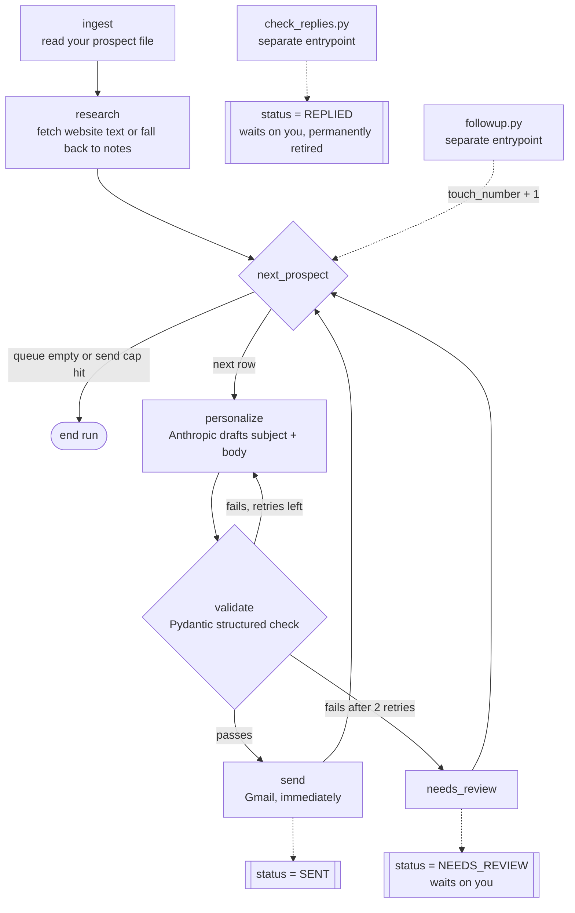

https://github.com/user-attachments/assets/a3461645-b498-48df-9469-99a390dc06b8

# Pitchwright

Sponsorship outreach that checks its own work before it sends.

A LangGraph agent that ingests a prospect list, researches each company, drafts a
grounded sponsorship email and sends it through Gmail —
without stopping to ask you.

An Excel workbook is the whole database. Every entrypoint reads and writes it
directly, so you can open it mid-run, sort it, fix a typo, or hand it to someone
who has never heard of Python.

---

## The only two things that need a human

The agent runs unattended. It drafts, validates, sends, and follows up on its own.
There is no approval queue and no "press enter to send" step.

It waits on you for exactly two reasons:

| Status | What it means | What you do |
|---|---|---|
| **`NEEDS_REVIEW`** | A draft could not pass the agent's own quality bar after its retries, or a send genuinely failed. | Read `last_error` on that row. Fix the draft, the fact sheet, or the address. Set the status back to `NEW` to let the agent retry it. |
| **`REPLIED`** | A real person answered. | Reply yourself, in Gmail. The agent will never touch this prospect again, and it will never write into a thread a human has replied to. |

Nothing else pauses. Not a draft it likes, not a follow-up, not a send.

---

## Architecture



### Node by node

**`ingest`** reads the prospect file you maintain (`data/prospects_input.csv`, or an
`.xlsx`) and appends anything new to the Prospects sheet as `status=NEW`,
`touch_number=1`. Contacts already on the sheet are skipped, so re-running is safe.
Rows without a usable email are logged and dropped.

**`research`** fetches each new prospect's website with the standard library, strips
the tags, and keeps the first 1,500 characters plus the meta description. If the
site is unreachable it falls back to your `notes` column. If there is nothing at
all it writes `research_notes = "no data found"` — and that is a completely normal
state. Everything downstream is built to pitch honestly from the fact sheet alone
rather than invent something to fill the gap.

**`personalize`** calls the model — a local Ollama model by default, the Anthropic
API (`ANTHROPIC_API_KEY`, never hardcoded) if you switch `LLM_PROVIDER` — with
two inputs and no others: the researched facts, and your fact sheet. The system
prompt forbids inventing any statistic, number, past sponsor, date, or claim that
is not literally present in those two sources, and says outright that a bland
email beats a fabricated one.

**`validate`** runs deterministic checks first — no unfilled placeholders, sane
subject and body length, the recipient's organisation named, the sender
identified, a way to reply present — and only then spends a token on the model.
That second pass is a structured-output call against a Pydantic `Verdict` model
(Ollama gets the schema through its `format` parameter, Anthropic through tool
use — same object comes back either way) whose main job is traceability: every factual claim in the draft has to walk back
to the fact sheet or the research notes, and anything that cannot comes back in
`unsupported_claims` and fails the draft.

A failure loops back to `personalize` with the specific errors as feedback, twice
(`MAX_VALIDATION_RETRIES`). Still failing after that means `NEEDS_REVIEW`, and the
row does not proceed to send.

**`send`** is not an approval step. Anything that passes validation goes out in the
same run. Two guardrails sit behind it, both background safety rather than review
gates:

- a hard cap on sends per run (`SEND_CAP`, default 25), checked before drafting so
  a capped run does not burn API calls on emails it will not send;
- a dedup check against the sheet itself — the same `contact_email` + `touch_number`
  is never delivered twice, including across separate runs.

A Gmail error does not crash the run: that row becomes `NEEDS_REVIEW` with the
error in `last_error`, and the agent moves on to the next one.

---

## The workbook

One file, two sheets. This is the single source of truth — there is no database
and no hidden state.

**Prospects**

| column | notes |
|---|---|
| `company`, `contact_name`, `contact_email`, `website`, `notes` | from your input file |
| `research_notes` | what `research` found, or `no data found` |
| `status` | `NEW` → `DRAFT` → `SENT` → `REPLIED`, or `NEEDS_REVIEW` |
| `touch_number` | 1 for the first email, 2 for the first follow-up, and so on |
| `draft_subject`, `draft_body` | the exact text that was or will be sent |
| `thread_id` | Gmail thread, used by `check_replies.py` |
| `sent_at`, `replied_at` | ISO-8601 with offset, e.g. `2026-09-20T19:21:28+05:30` |
| `reply_snippet` | a short extract of what they wrote back |
| `last_updated`, `last_error` | `last_error` is the reason a `NEEDS_REVIEW` row is waiting |

**Log** — one row per node per prospect per run: `timestamp`, `node`, `prospect`,
`outcome`. This is the audit trail. If you want to know why something did or did
not go out, it is here.

---

## Setup

### 1. Install

```bash
pip install -r requirements.txt
```

### 2. Environment

```bash
cp .env.example .env
```

Everything has a working default. `.env` is gitignored and must stay that way.

### 2b. The model — local by default

`LLM_PROVIDER=ollama` is the default, so drafting and validation both run on a
local model and no email text leaves the machine. You need Ollama running and at
least one model pulled:

```bash
ollama list
```

Put a name from that list in `OLLAMA_DRAFT_MODEL`. A bare name matches a tagged
one, so `llama3.1` finds `llama3.1:8b`. Leave it blank and the first installed
model is used — nothing is hardcoded, and a model that is not pulled fails
immediately with the exact `ollama pull <model>` command to fix it rather than a
stack trace. Ollama not running gives you a one-line message saying so.

`OLLAMA_VALIDATE_MODEL` can differ from the drafting model and defaults to it
when blank. Running a larger, slower model as the judge is worth considering:
validation runs once per draft and it is the only thing standing between an
invented statistic and a sent email.

To use the hosted API instead, set `LLM_PROVIDER=anthropic` and fill in
`ANTHROPIC_API_KEY`. That path is unchanged and still works; it is just no longer
required.

### 3. Fact sheet — the only source of claims about you

```bash
cp config/fact_sheet.example.json config/fact_sheet.json
```

Then replace every value with real, verifiable numbers. The example ships with
zeroes and placeholder text on purpose: the agent may only state what this file
says, so a number you leave fake is a number that gets pitched as fact. Delete any
key you cannot back up rather than guessing — a missing field just means the email
does not mention it.

Markdown works too: point `FACT_SHEET_PATH` at a `.md` file and it is passed
through as text.

`config/fact_sheet.json` is gitignored. The `.example.json` is what gets committed.

### 4. Your prospect list

```bash
cp data/prospects_input.example.csv data/prospects_input.csv
```

**`data/prospects_input.csv` is where your real list goes, and it is gitignored.**
Never commit it. The committed example contains only obviously fake rows — Acme
Robotics, `notreal@example.com`, `example.org` — that exist to exercise the code
paths (reachable site, no site, unreachable site) and nothing else.

Columns: `company, contact_name, contact_email, website, notes`. An `.xlsx` with the
same headers works — set `INPUT_FILE` to point at it.

### 5. Gmail OAuth (one time)

1. Go to the [Google Cloud Console](https://console.cloud.google.com/) and create a
   project, or pick an existing one.
2. **APIs & Services → Library → Gmail API → Enable.**
3. **APIs & Services → OAuth consent screen.** External is fine for a personal
   account. Add your own Gmail address under **Test users** — without that, the
   token flow is rejected.
4. **APIs & Services → Credentials → Create credentials → OAuth client ID →
   Desktop app.**
5. Download the JSON and save it as `config/credentials.json`.
6. Run any entrypoint. A browser opens, you grant access once, and
   `config/token.json` is written. Subsequent runs refresh it silently.

Scopes requested: `gmail.send` and `gmail.readonly`. Both `credentials.json` and
`token.json` are gitignored — they are credentials, treat them like passwords.

### 6. Dry run first

Set `DRY_RUN=true` in `.env` and run the pipeline. It does everything except the
actual Gmail call: ingests, researches, drafts, validates, and logs what it *would*
have sent. Read the drafts in the workbook. Then set it back to `false`.

---

## Running it

```bash
python main.py            # ingest -> research -> draft -> validate -> send
python check_replies.py   # poll Gmail, mark replies, hand them to you
python followup.py        # touch 2+ for anyone who never answered
```

### On a schedule

Both options work; pick one.

**Windows Task Scheduler** — one task per script, e.g. `main.py` daily at 09:00,
`check_replies.py` every 2 hours, `followup.py` daily at 10:00. Set *Start in* to the
project directory so the relative paths in `.env` resolve.

```powershell
schtasks /create /tn "outreach-main" /tr "\"C:\Path\To\python.exe\" \"D:\AI AGENT\main.py\"" /sc daily /st 09:00
```

**cron** (Linux/macOS):

```cron
0  9 * * 1-5  cd /path/to/project && ./.venv/bin/python main.py           >> logs/main.log 2>&1
0  */2 * * *  cd /path/to/project && ./.venv/bin/python check_replies.py  >> logs/replies.log 2>&1
0 10 * * 1-5  cd /path/to/project && ./.venv/bin/python followup.py       >> logs/followup.log 2>&1
```

Run `check_replies.py` more often than `followup.py`. A reply that lands before the
follow-up job runs is what stops the agent emailing someone who is already talking
to you.

### Configuration

Every variable lives in `.env` — see `.env.example` for the full list. The ones that
change behaviour:

| variable | default | what it does |
|---|---|---|
| `LLM_PROVIDER` | `ollama` | `ollama` (local) or `anthropic` (hosted fallback) |
| `OLLAMA_HOST` | `http://localhost:11434` | where the Ollama daemon is |
| `OLLAMA_DRAFT_MODEL` | first installed | model that writes the draft; must be pulled |
| `OLLAMA_VALIDATE_MODEL` | same as draft model | model that judges the draft; bigger is better here |
| `SEND_CAP` | `25` | hard cap on sends per run |
| `MAX_VALIDATION_RETRIES` | `2` | redrafts before a row goes to `NEEDS_REVIEW` |
| `FOLLOWUP_DAYS` | `5` | silence before a follow-up is due |
| `DRY_RUN` | `false` | do everything except the Gmail send |
| `ANTHROPIC_MODEL` | `claude-sonnet-5` | model used for drafting and validation |

---

## Follow-ups

`followup.py` finds `SENT` rows that are unanswered, older than `FOLLOWUP_DAYS`, and
do not already have a next touch on the sheet. For each one it appends a
`touch_number + 1` row and runs it through the same personalize → validate → send
path, with the previous email passed in as context so it reads as a follow-up
rather than a cold restart. It sends into the original Gmail thread.

It is fully autonomous and fails the same way the main pipeline does: repeated
validation failure or a send error means `NEEDS_REVIEW`, not a crash.

A prospect who replied on *any* touch is excluded from *every* future touch. That
check runs when the follow-up queue is built and again immediately before the send,
so a reply that arrives mid-run still stops the email.

---

## Tests

```bash
python -m pytest -q
```

Every model and Gmail call is mocked; nothing reaches the network. The suite
covers the validate retry loop and its feedback, the send cap, the dedup check
across separate runs, the `NEEDS_REVIEW` transition on both repeated validation
failure and a simulated Gmail error, an LLM outage ending as `NEEDS_REVIEW`
rather than a crash, and a `REPLIED` prospect being excluded from `followup.py`'s
eligible set.

The Ollama HTTP layer has its own tests with `urlopen` mocked: a successful
schema-constrained call, a malformed-JSON response that gets re-prompted and
recovers, giving up after two bad responses, the "model not pulled" error, and
the "Ollama is not running" error.

---

## Scope — what this actually is

**This system has sent zero emails.** It is a fresh build with a passing test suite
and no production track record. Any claim about response rates, conversion, or
prospects reached would have to come from your own runs.

For clarity, since it tends to come up: the *predecessor* n8n workflow's "300+
prospects reached" is that earlier system's historical result. It is not a result
of this codebase and should not be quoted as one.

### Known limits

- **Research is shallow.** One page fetch, tags stripped, first 1,500 characters.
  No crawling, no JavaScript rendering, no LinkedIn or news lookup. Many sites will
  yield `no data found`, which is handled honestly rather than papered over.
- **Grounding is enforced, not guaranteed.** The drafting prompt forbids invention
  and the validator hunts for untraceable claims, but it is one model checking
  another. Read the first batch of drafts yourself before trusting it unattended.
- **The judge is no longer stronger than the writer.** With the local default,
  validation is done by the same class of model that could make the mistake, not
  by an independent, more capable reviewer. A local model can miss a fabricated
  number that Claude would have caught — and it writes the draft too, so both
  halves share the same blind spots. Read every draft in the workbook for the
  first several real runs. An empty `NEEDS_REVIEW` column means nothing was
  flagged, not that the drafts were actually clean.
- **The workbook is opened and saved on every write.** Fine for hundreds of rows,
  visibly slow at tens of thousands. Move to SQLite if you get there.
- **Deliverability is out of scope.** No SPF/DKIM checks, no warm-up, no bounce
  webhook. A hard bounce surfaces as a Gmail send error; a bounce that arrives
  later as a message shows up as a `REPLIED` row you will have to read.
- **One mailbox, sequential sends.** No parallelism, no rate-limit backoff beyond
  what the Gmail client does itself.
- **Nothing decides who to contact.** The prospect list is yours to build and yours
  to keep lawful — consent, CAN-SPAM/GDPR, and an unsubscribe path are your
  responsibility, not the agent's.

### Not committed, ever

`data/outreach.xlsx`, `data/prospects_input.csv`, `config/fact_sheet.json`,
`config/credentials.json`, `config/token.json`, `.env`. All are in `.gitignore`.
The only data in this repository is fake.
